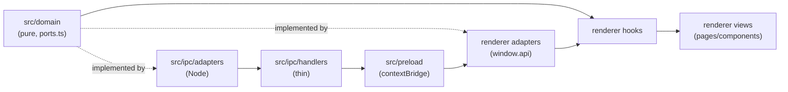

# Architecture

> [!WARNING]
> This page still describes the Electron host, which this repository no longer has. The renderer and `src/domain` sections are accurate; everything about the main process, the preload bridge and `src/ipc` describes [StratumServer/RiftLauncher](https://github.com/StratumServer/RiftLauncher) instead. The host side of this repository is `src-tauri`, and the bridge is `src/renderer/src/host/tauriApi.ts`. Rewriting this page waits until the host stops being a skeleton.

This is the map for a new contributor who knows TypeScript but has never opened this repository. It describes how the code is actually layered today, not how a launcher in general could be layered. Every claim below was checked against the source at the path given; if the code moves, trust the code over this page and file a correction.

RiftLauncher is an Electron 44 + React 18 app. The trusted side (main process) owns the file system, the network, and the game process. The renderer owns the UI and talks to the trusted side only through a preload bridge. In between sits `src/domain`, a layer that knows the launcher's rules without knowing Electron exists.

## The layering

Four layers, one direction of dependency.

**`src/domain`** is pure business logic: what a backup is allowed to do, how a config document migrates, which executable name a platform expects, how to read an Inno Setup installer byte by byte. It never imports Electron, Node, React or the renderer. It reaches the outside world only through the ports declared in `src/domain/ports.ts` (321 lines: `FileSystem`, `Archiver`, `Extractor`, `Downloader`, `Unpacker`, `DirectoryReader`, `ModArchiveReader`, `IconStore`, `Clock`, `IdGenerator`, `PathBuilder`, `ProcessProbe`, `JsonFile`, `GameProcess`, `CloseGuard`) and, for the Inno reader specifically, `src/domain/inno/ports.ts`. A typical port reads like this:

```ts
// src/domain/ports.ts:10-20
export interface FileSystem {
  exists(path: string): Promise<boolean>
  remove(path: string): Promise<boolean>
  move(from: string, to: string): Promise<boolean>
}
```

This purity is not a convention someone has to remember. It is enforced by an ESLint `no-restricted-imports` rule scoped to `src/domain/**/*.ts`, in `.eslintrc.cjs:10-37`:

```js
{
  // src/domain holds pure business logic. It reaches the outside world only
  // through the ports in src/domain/ports.ts, never through a host API.
  files: ["src/domain/**/*.ts"],
  rules: {
    "no-restricted-imports": ["error", {
      paths: [
        { name: "electron", message: "src/domain must stay free of Electron. Add a port instead." },
        { name: "fs", message: "src/domain must stay free of Node. Use the FileSystem port." },
        // fs/promises, fs-extra, path, child_process, react, react-dom follow the same shape
      ],
      patterns: [
        { group: ["node:*"], message: "src/domain must stay free of Node built-ins. Add a port instead." },
        { group: ["electron/*"], message: "src/domain must stay free of Electron. Add a port instead." },
        { group: ["@renderer/*", "@src/ipc/*"], message: "src/domain must not depend on the renderer or the IPC layer." }
      ]
    }]
  }
}
```

It runs on every PR through `npm run lint:ci` (`package.json:16`, wired into `.github/workflows/ci.yml:23-33`). If you write `import fs from "fs"` inside `src/domain`, CI fails, not silently later.

**Adapters** implement the ports twice, once per side, because the same port has to run under two different runtimes:

- Main-process adapters, under `src/ipc/adapters/`, use real Node. `src/ipc/adapters/modScan.ts` imports `crypto`, `electron` (for `app.getPath`), `fs-extra` and `yauzl`, and wires `ModArchiveReader`, `IconStore` and `DirectoryReader` onto the real disk.
- Renderer adapters, under `src/renderer/src/adapters/` and `src/renderer/src/features/*/adapters/`, call `window.api`, the surface the preload script exposes. `src/renderer/src/adapters/fileSystem.ts:4-10` wires `FileSystem` onto three IPC calls:

```ts
export function createFileSystemPort(): FileSystem {
  return {
    exists: (path) => window.api.pathsManager.checkPathExists(path),
    remove: (path) => window.api.pathsManager.deletePath(path),
    move: (from, to) => window.api.pathsManager.movePath(from, to)
  }
}
```

Neither adapter is allowed to leak into the domain; both are allowed to import it.

**IPC handlers**, under `src/ipc/handlers/`, are the seam between the renderer's `window.api.*` calls and the main process. Most are thin in the literal sense: validate the payload shape, call a domain function with a Node-backed adapter, translate the result, return. `src/ipc/handlers/configHandlers.ts` is the clean case, 22 lines end to end:

```ts
ipcMain.handle(IPC_CHANNELS.CONFIG_MANAGER.SAVE_CONFIG, async (event, config: ConfigType): Promise<SaveConfigResult> => {
  assertTrustedIpcSender(event)
  if (!isRecord(config)) return invalidPayloadResult()
  const normalizedConfig = normalizeConfig(config)
  const currentConfig = await getConfig()
  if (!(await assertConfigPathsAuthorized(normalizedConfig, currentConfig))) return unauthorizedPathResult()
  return saveOutcomeToResult(await saveConfig(normalizedConfig))
})
```

Not every handler stays this thin. `src/ipc/handlers/gameHandlers.ts` also builds real Node-backed ports in place (`realProcessProbe`, `realGameProcess`, a `spawn`-based process runner with its own timeout) because launching a game process is itself substantial main-process work. Read a handler expecting "validate, call domain, call adapter, shape the response" as the norm, and treat a handler that grows past that as a sign the file is doing adapter work that could be pulled out, not as the established pattern.

**Views** render and call hooks. `src/renderer/src/features/*/pages/*.tsx` components almost never call `window.api` directly (the only call sites left across the pages folder are fifteen `window.api.utils.logMessage` calls, spread over five pages) and mostly don't call domain functions directly either; they call a feature hook (`useInstallVersion`, `useMakeInstallationBackup`, `useUninstallGameVersion`, and others) that owns the ports wiring, the domain call and the reducer dispatch. A handful of pages (`AddInstallation.tsx`, `ListInstallations.tsx` among them) import a domain function straight from `@domain/*` and call it inline with a ports object built on the spot, rather than through a dedicated hook. That is a real exception, not a hook you failed to find: treat "goes through a hook" as the default for a new slice, not an absolute rule every existing page follows.



The domain is consumed from both ends but depends on neither. The preload script (`src/preload/index.ts`, 107 lines) is the only file allowed to call both `contextBridge` and `ipcRenderer`; everything past it on the renderer side is `window.api.*`.

## The verdict convention

Almost every domain service returns a discriminated union instead of throwing: `{ ok: true; ... }` or `{ ok: false; reason: <named union> }`. A few examples, picked because each names its reasons differently:

- `src/domain/installations/backup.ts:57`: `MakeInstallationBackupResult = { ok: true; backup: BackupRecord; deletedBackupIds: string[] } | { ok: false; reason: MakeInstallationBackupFailure; deletedBackupIds: string[] }`, with `MakeInstallationBackupFailure` an 8-member union (`installation-busy`, `installation-playing`, `restore-in-progress`, `installation-path-missing`, `no-backups-folder`, `backups-disabled`, `prune-failed`, `compress-failed`).
- `src/domain/mods/moddb.ts:33`: `ModDbResponse<T> = { ok: true; payload: T } | { ok: false; reason: ModDbApiFailure; statusCode?: string }`.
- `src/domain/config/migrations.ts:82-94`: a 6-member `ConfigMigrationOutcome` (`unreadable`, `already-current`, `migrated`, `future-schema`, `chain-broken`, `migration-failed`), each with a one-line comment on why it is not folded into another.

Reasons are never generic. `MakeInstallationBackupFailure` used to be three cases collapsed into one silent no-op; the comment above the type at `backup.ts:38-46` explains they were split apart specifically so the UI could tell a player what actually happened instead of doing nothing and saying nothing.

Turning a reason into a sentence is the renderer's job, not the domain's, and it happens in `describe*Failure` functions that live in `src/renderer/src/features/*/adapters/*.ts` (never in `src/domain`). The fullest example is `describeBackupFailure`, `src/renderer/src/features/installations/adapters/backup.ts:95-113`:

```ts
export function describeBackupFailure(reason: MakeInstallationBackupFailure): BackupFailureFeedback {
  switch (reason) {
    case "installation-busy":
      return { messageKey: "features.backups.backupInProgress", logged: false }
    case "restore-in-progress":
      return { messageKey: "features.backups.restoreInProgress", logged: false }
    case "prune-failed":
    case "compress-failed":
      return { messageKey: "features.backups.errorMakingBackup", logged: true }
    case "installation-path-missing":
      return { messageKey: "features.backups.installationPathMissing", logged: true }
    // ...
  }
}
```

Each `messageKey` names an i18n key; `logged` tells the caller whether the refusal is also worth a log line. The pattern repeats across the mods, versions and installations features (`describeRestoreFailure`, `describeCreateInstallationFailure`, `describeModInstallFailure`, `describeInstallFailure`, `describeUninstallFailure`, and `configSaveFailureMessageKey` in `src/renderer/src/features/config/utils/saveHealth.ts:62`), and the TypeScript compiler enforces exhaustiveness on every one of these switches, so a new reason with no case is a build failure, not a silent fallthrough.

The on-screen sentences follow a shape the code calls "house voice" (the phrase appears once, verbatim, in `saveHealth.ts:61`: "the i18n key naming why saves are failing, in house voice, with the way out"). Reading the actual strings in `src/renderer/src/locales/en-US.json` shows what that means in practice: the verdict comes first, the way out comes last, and nothing in between assumes the reader knows what a config schema or a close guard is.

```
"installationPathMissing": "No backup made: this Installation has no data yet. Play it once to generate the data first."
"noBackupsFolder": "No backup made: you haven't set a Backups folder. Set one on the Config page."
"backupsDisabled": "No backup made: this Installation's Backups max amount is set to 0. Raise it on the Installation's edit page to turn backups back on."
```

Verdict, reason, way out. No jargon, no stack trace, no reason left unresolved into an action the player can take.

## The patterns, with their canonical examples

**Plan-then-execute**: `src/domain/mods/importModpack.ts`. A modpack import used to interleave deciding and acting in one loop: query the ModDB, delete the installed copy, start a download, repeat. Nothing about that could be shown, counted, or tested before the first file was already gone. The module doc (lines 6-18) explains the fix: `planModpackImport` (line 202) is a pure function that turns manifest entries into a plan (`"install"` or `"skip"`, with a named `ModpackSkipReason`) without touching a single file. `executeModpackImport` (line 277) walks that plan afterward, one entry at a time, and keeps going past individual failures so a 40-mod pack with one delisted mod still installs the other 39.

**Settle-once**: `src/ipc/adapters/modScan.ts`, function `readModArchive` (lines 42-154). Reading a zip with `yauzl` has several exit paths (open error, oversize entry, unreadable stream, end of archive, zip-level error), and an earlier version had a branch that resolved its promise without closing the archive handle, leaving it reading in the background after the scan had already counted it done. The fix is a `settled` boolean and a single `settle()` closure that every exit path calls, which both closes the handle and resolves the promise exactly once (lines 51-56).

**Migration pipeline**: `src/domain/config/migrations.ts`. Pure, no file system, no Electron (module doc, lines 11-18). `detectConfigSchema` (line 134) reads whichever marker a stored document carries (`integer` `schemaVersion`, legacy float `version`, or neither) and `migrateConfigDocument` (line 243) then walks registered `ConfigMigration` steps, keyed by `fromSchema` in a `Map`, until the target schema is reached, stamping `schemaVersion` after each step rather than trusting a migration to do it. Two migrations are registered today, in `CONFIG_MIGRATIONS` (line 221): `floatMarkerToIntegerSchema` (lines 174-186), which drops the old `version` field and nothing else, and `stampLinkedOnExternalVersions`. Everything else about the document survives byte for byte.

**Save-health state machine**: `src/renderer/src/features/config/utils/saveHealth.ts`. `ConfigContext` autosaves on every config change, fire-and-forget, so a single transient write failure is not worth interrupting the player over, but a persistent one is. `updateConfigSaveHealth` (line 51) folds each save result into `{ failureStreak, notifiedFailing }`, only surfacing a "saves are failing" notice once the streak crosses `CONFIG_SAVE_FAILURE_STREAK_THRESHOLD = 2` (line 21), and only once per streak; recovery is reported the same way, once, and only if a failure notice actually fired first. Pulled out of `ConfigContext.tsx` specifically so the decision table could be pinned by a test without mounting the provider tree.

**Per-OS strategy**: `src/domain/versions/gameExecutable.ts`. `toGameOs(platform)` (lines 19-23) narrows any host platform string down to `"win32" | "darwin" | "linux"`, defaulting unknowns to Linux. `expectedGameExecutables(os)` (lines 35-44) is a switch naming which executable files prove the game landed: `Vintagestory.exe` on Windows, `Vintagestory` and `Vintagestory.exe` on Linux (the second is a fallback for old builds with no native Linux launcher, run through `mono`), nothing on macOS, since the launcher cannot start the game there yet. `gameExecutableCandidates(os)` (lines 72-77) pairs each name with how it has to be launched (`"direct" | "mono"`) without changing the file list itself.

**Context-split with stable dispatch**: `src/renderer/src/features/config/contexts/ConfigContext.tsx`. One `useReducer` feeds nine separate React contexts split by slice: `ConfigDispatchContext`, `InstallationsContext`, `GameVersionsContext`, `AccountContext`, `SettingsContext`, `FavModsContext`, `CustomIconsContext`, `NotifiedModUpdatesContext`, `SuspendedModUpdatesContext` (lines 34-44). A component that only dispatches subscribes to `ConfigDispatchContext`, whose value never changes for the life of the provider (comment at line 176: "Stable for the life of the provider, so subscribing to it never costs a render"), so it never re-renders when unrelated state changes. List slices are handed out as-is, since the reducer never rebuilds an array it did not touch; composed slices (`account`, `settings`) are wrapped in `useMemo` to keep the same referential-stability guarantee (from line 123).

**The Inno reader**: `src/domain/inno/`, 13 files. A from-scratch reader for Inno Setup 6.4.x installer archives (`version.ts` refuses anything outside that family), pure TypeScript apart from its own `ports.ts` for host I/O. The point, stated in `extract.ts:1-21`, is extracting the game without running the installer's script at all: no script means no `InitializeSetup` MsgBox, no uninstall registry key, nothing outside the game's own folder. `loader.ts` finds the header offsets by searching for Inno's loader marker rather than parsing the PE resource table; `blocks.ts` reads the two CRC32-checked, LZMA-compressed header blocks; `script.ts` parses only what extraction needs and drops `[Registry]`/`[Run]`/`[Icons]` on purpose; `callFilter.ts` undoes the compiler's CALL/JMP address transform; `lzma.ts` (670 lines, the largest file) is a hand-written LZMA1/LZMA2 decoder, written because no suitable pure-JS package decodes LZMA2 without a native or WASM dependency; `extract.ts` (345 lines) is the orchestrator, and every file it writes is checked against the SHA-256 the installer itself declares, so a wrong read fails on the spot instead of producing a silently broken install.

## The gates that defend the rules mechanically

Five job definitions live in `.github/workflows/ci.yml`: `typecheck`, `lint` (`lint:ci` + `format:check`), `test` (`test:coverage`), `sonarcloud` (informational, `continue-on-error: true`), and `build` (`build:unpack`, on Ubuntu and Windows). Four of them run on every PR; `sonarcloud` is gated on `github.event_name == 'push' || github.event.pull_request.head.repo.full_name == github.repository` (line 49), so it runs on pushes and on pull requests from a branch of this repository, and is skipped on pull requests from a fork. A sixth, `build-macos`, is `workflow_dispatch`-only.

**Coverage ratchet**: `vitest.config.ts:40-84`, provider `v8`, thresholds `{ lines: 89, statements: 87, functions: 85, branches: 85 }`. The `include` list is deliberately narrow:

```ts
include: [
  "src/domain/**",
  "src/main/**",
  "src/ipc/**",
  "src/utils/**",
  "src/config/**",
  "src/renderer/src/adapters/**",
  "src/renderer/src/hooks/**",
  "src/renderer/src/utils/**",
  "src/renderer/src/contexts/**",
  "src/renderer/src/features/**/hooks/**",
  "src/renderer/src/features/**/adapters/**",
  "src/renderer/src/features/config/contexts/**",
  "src/renderer/src/features/config/utils/**"
]
```

Pages, components, `App.tsx`, `main.tsx` and `i18n.ts` are excluded on purpose, and the comment above `include` says exactly why: "line-covering JSX is theater, not a signal worth gating on." The `renderer-dom` harness (below) still exercises presentation, through behavior, but the ratchet only counts logic a unit test can pin a return value against.

**i18n parity suite**: `tests/i18n/i18n-parity.test.ts` and `tests/i18n/helpers.ts`. It is not a strict "every locale must match en-US" check; the doc comment at the top of the file (lines 8-22) is explicit that a locale lagging behind en-US is expected, not a failure. What does fail the suite: a `t()` call site in `src/renderer/**` referencing a key that does not exist even in `en-US.json` (collected by regex-scanning call sites, then diffed against the flattened key set), any locale file (`en-US.json` included) that fails to parse or holds an empty-string value, and a `t()` call whose `en-US` string needs an interpolation object that the call site never passes.

**Tests typechecked separately**: `tsconfig.tests.json` extends `tsconfig.node.json`, includes `tests/**/*` plus `src/global.d.ts` and `src/preload/preload.d.ts`, excludes `tests/e2e/**`. `npm run typecheck:tests` runs `tsc --noEmit -p tsconfig.tests.json`, and `npm run typecheck` (run in CI) chains `typecheck:node`, `typecheck:web` and `typecheck:tests` together, so a test file with a type error fails the build the same way application code would.

**Strict TS flags**: `tsconfig.node.json` and `tsconfig.web.json` both extend `@electron-toolkit/tsconfig`, which sets `strict: true`, `noUnusedLocals`, `noUnusedParameters`, `noImplicitReturns` and `isolatedModules`. Both configs additionally set `noImplicitAny: true` and `noUncheckedIndexedAccess: true` directly (`tsconfig.node.json:13-19`, `tsconfig.web.json:12-16`), the latter being why array/map access in this codebase routinely carries a `!` or an explicit undefined check.

**The purity rule**: the `no-restricted-imports` override in `.eslintrc.cjs`, quoted in full under "The layering" above.

**Pages around 250 lines**: this is an observed convention, not a mechanical gate. No `max-lines` ESLint rule, no line-count script, and no CI step enforces it; a repo-wide search turns up nothing. Most files under `src/renderer/src/features/**/pages/*.tsx` sit under 250 lines, but four have grown past it: `ListMods.tsx` at 301, `ConfigPage.tsx` at 295, `ManageMods.tsx` at 261 and `ListInstallations.tsx` at 257. Treat 250 as a soft ceiling contributors aim for, and a page over it as worth splitting, not as something CI will catch for you.

## Testing doctrine

**In-memory fakes with sequence assertions.** Domain tests build a fake for every port and push a string onto a shared `trace: string[]` from inside each fake method, then assert the whole trace in order. `tests/domain/installations/restore.test.ts:158-175` is representative:

```ts
assert.deepEqual(trace, [
  `exists:${ARCHIVE_PATH}`,
  "guard-acquire:Restoring an installation backup.",
  "started",
  `extract:${ARCHIVE_PATH}->${STAGING_PATH}`,
  `move:${INSTALLATION_PATH}->${REPLACED_PATH}`,
  `move:${STAGING_PATH}->${INSTALLATION_PATH}`,
  `remove:${REPLACED_PATH}`,
  "guard-release",
  "finished"
])
```

This proves the service does the right things in the right order, not just that it returns the right final value; the same shape recurs in `tests/domain/installations/backup.test.ts`, `tests/domain/versions/install.test.ts`, `tests/domain/versions/uninstall.test.ts`, `tests/domain/mods/install.test.ts` and `tests/domain/account/login.test.ts`.

**Red/green pinning on refactors** is not a documented house rule beyond ordinary practice; there is no CONTRIBUTING entry for it. What the tests do consistently is pin specific, sometimes surprising behavior in a comment next to the assertion, e.g. `tests/ipc/accountLoginOutcome.test.ts:35`: "this pins that the outcome mapper does not concatenate anything else in." Read a comment like that as a signal that the behavior was chosen on purpose and a change to it needs a reason, not just a passing test.

**Three harnesses**, configured as two Vitest projects in `vitest.config.ts` plus one convention inside the first:

1. **node**: plain Vitest, `environment: "node"`, `include: ["tests/**/*.test.ts"]`. Covers `tests/domain/**` and most of `tests/ipc/**`.
2. **renderer-dom**: `environment: "jsdom"`, `include: ["tests/renderer-dom/**/*.test.tsx"]`, `setupFiles: ["tests/renderer-dom/setup.ts"]`, with the `@vitejs/plugin-react` plugin. `tests/renderer-dom/helpers/render.tsx` wraps a component under test in `MemoryRouter` → `NotificationsProvider` → `ConfigProvider` (the router is skippable, with `route: false`) and drives it with `@testing-library/user-event`, asserting through mocked `window.api` calls rather than mocking the feature code.
3. **mocked-electron with real-byte fixtures**: still part of the `node` project, but files under `tests/ipc/` that need `electron` to exist import `tests/ipc/helpers/electronMock.ts`, which does `vi.mock("electron", () => ({ app: {...} }))` so a main-process adapter can load under plain Node. These tests pair the mock with real binary fixtures committed under `tests/fixtures/` (`valid-mod.zip`, `zip64.zip`, `tests/fixtures/inno/*.bin`, built by `tests/fixtures/build-fixtures.ts` and friends), so a zip-parsing edge case is tested against actual zip bytes rather than a hand-rolled stub.

**Opt-in e2e via env vars.** `tests/e2e/windows-install.ts` is not a Vitest suite at all (excluded from `tsconfig.tests.json`, not matched by any Vitest include glob); it refuses to run unless `process.env.CI` is set, and refuses off Windows, because it seeds a real HKCU uninstall registry key to reproduce issue #8. Inside the ordinary node harness, `tests/ipc/extraction.test.ts` and `tests/ipc/innoExtraction.test.ts` gate their one real-archive test behind `RIFT_E2E_ARCHIVE` / `RIFT_E2E_INNO` (plus `RIFT_E2E_VERSION`) environment variables that CI never sets: `RIFT_E2E_ARCHIVE=/tmp/vs_client_linux-x64_1.22.6.tar.gz RIFT_E2E_VERSION=1.22.6 npm test`.

## How to add a feature slice

Traced end to end through an existing slice, installation backups, since every layer of it exists and is tested:

1. **Domain service + ports.** `src/domain/installations/backup.ts` defines `MakeInstallationBackupPorts` (built only from ports already declared in `src/domain/ports.ts`) and the discriminated `MakeInstallationBackupResult`.
2. **Domain tests.** `tests/domain/installations/backup.test.ts` fakes every port and asserts trace sequences, the way described above.
3. **Adapter.** `src/renderer/src/features/installations/adapters/backup.ts` wires the domain's ports onto `window.api` and the task manager (`createBackupPorts`), and defines `describeBackupFailure` to turn a refusal reason into an i18n key plus a `logged` flag.
4. **Hook.** `src/renderer/src/features/installations/hooks/useMakeInstallationBackup.ts` imports the domain function directly, reads what it needs from `ConfigContext`, builds ports through the adapter, and calls the domain function.
5. **View wiring.** `src/renderer/src/features/installations/pages/ManageInstallationBackups.tsx` and `src/renderer/src/features/installations/components/BackupsSettingsSection.tsx` call the hook and render `t("features.backups...")` keys. The only `window.api` call in the page is `window.api.utils.logMessage`. Domain purity is not as clean: the backup creation flow goes through the hook, but the restore and delete flows do not, and `ManageInstallationBackups.tsx` imports `restoreInstallationBackup`, `deleteInstallationBackup` and `installedModsTotal` straight from `@domain/*` (lines 6-8) and calls them in its own handlers. Read the hook as the shape to aim for, not as a description of what every handler on this page does today.
6. **i18n, en-US only.** New keys go into `src/renderer/src/locales/en-US.json` first. The other 13 locale files under `src/renderer/src/locales/` (`be-BY`, `de-DE`, `es-ES`, `fr-FR`, `hu-HU`, `it-IT`, `nl-NL`, `pl-PL`, `pt-BR`, `pt-PT`, `ru-RU`, `uk-UA`, `zh-CN`) are allowed to lag; the parity suite says so explicitly and only fails on a key missing from en-US itself, never on a translation not yet caught up.
7. **Gates.** The hook and adapter fall inside the coverage `include` globs (`src/renderer/src/features/**/hooks/**`, `**/adapters/**`); the page does not, and is exercised instead through a `renderer-dom` test if the slice is significant enough to warrant one (see `tests/renderer-dom/installationsRestoreBackup*.test.tsx` for the sibling restore flow). Domain purity, strict TS, lint and format all apply the same as anywhere else.

## Pointers

**The shell question.** `docs/decisions/0001-shell-and-codebase.md` is a live, measured comparison of three options for what RiftLauncher's shell should be: stay on Electron, port the trusted side to Tauri v2, or adopt a separate finished C#/Avalonia launcher ("Prospect") as the new base. It is not yet decided (status: proposed, decision: pending). Read it before assuming Electron is a permanent choice, and read it again before proposing a shell-level change; the numbers in it (install size, memory, lines of code bound to Electron) were measured against this same codebase and are the reference point any new proposal has to beat or explain.

**Issue labels.** No dedicated labels document exists. The labels actually in use, from the repository itself: `bug`, `documentation`, `duplicate`, `enhancement`, `good first issue`, `help wanted`, `invalid`, `question`, `wontfix`, plus three repo-specific ones worth knowing: `roadmap` ("Planned refactoring stage", the label the roadmap doc points to as the living roadmap, see `docs/important-info/roadmap.md`), `team decision` ("Needs a call from the team, not a lone contributor"), and `tech debt` ("Inherited debt, tracked to be paid down"). Issue #31 and #24, both cited on this page, are `tech debt`.
